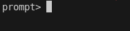
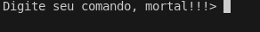

# Gerando o prompt na tela e esperando o usuário digitar

Um difirencial do minishell pros outros projetos é o prompt, que **deve** esperar o input do usuário e só sair do estado de espera quando o usuário apertar a tecla **Enter**.

Para ver esse prompt de modo simples e rápido, vamos usar a função ``readline``, uma das funções mais úteis de todas as permitidas.

```c
#include <readline/readline.h>

int	main(void)
{
	readline("prompt> ");
	return (0);
}
```

Neste exemplo, apenas iremos esperar o usuário digitar algo e depois encerrar o programa.

Você vai compilar usando ``-l readline``, como no exemplo:

```sh
cc file.c -l readline
```

Feito isso, você verá uma tela assim, quando executar o programa:



E tá pronto o sorvetinho! \o/

🎉🎉🎉 Você conseguiu criar um prompt que espera até o usuário apertar **Enter**. 🎉🎉🎉

## Personalizar o prompt

O argumento da função readline é o prompt que você quer ver na tela. Caso você queira ver:



Basta mudar o argumento da readline para:

```c
readline("Digite seu comando, mortal!!!> ");
```

## Salvar o comando digitado em uma variável

Ao ler o man da função readline, vemos que ela retorna um ``char *``, basta então pegar o retorno e ser feliz. RTFM continua válido aqui.